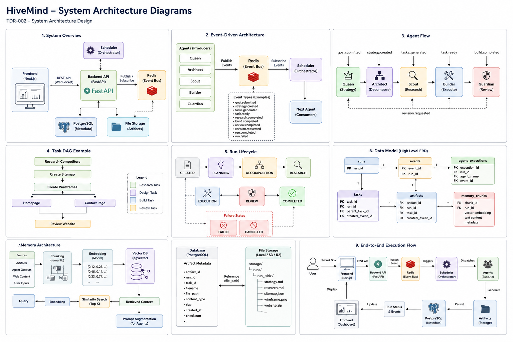

# TDR-002: System Architecture

## Status

Accepted

---

## Context

HiveMind is a multi-agent operating system designed to transform high-level user goals into executable workflows through autonomous AI agents. The platform is intended to function as a digital organization where specialized agents collaborate to plan, research, execute, review, and refine work.

The primary objective of HiveMind is not to provide a conversational chatbot experience, but to explore and implement principles of AI systems engineering, event-driven architectures, distributed execution, agent orchestration, and organizational memory.

To achieve these goals, HiveMind requires an architecture that supports:

* Independent and replaceable agents
* Scalable workflow execution
* Persistent organizational memory
* Observable system behavior
* Future distributed deployment
* Provider-agnostic AI integrations

This document defines the foundational system architecture for HiveMind Version 1.

---

# Architectural Principles

## 1. Event-Driven First

All agent interactions must occur through events published to the system event bus.

Agents never communicate directly with one another.

Benefits:

* Loose coupling
* Independent deployment
* Easier testing
* Improved scalability
* Future distributed execution support

---

## 2. Agents Are Replaceable

Agents represent business capabilities rather than implementation details.

The system must allow agent prompts, models, tools, and implementations to evolve without impacting other services.

---

## 3. Persistent Organizational Memory

HiveMind maintains long-term memory through artifact storage and vector retrieval.

Knowledge generated during execution should remain accessible to future workflows.

---

## 4. Observable Workflows

Every significant system action must generate an event.

System behavior should be traceable through logs, events, and execution records.

---

## 5. Provider-Agnostic AI Integration

The architecture must not depend on any specific AI provider.

Models from OpenAI, Anthropic, Google, local models, or future providers should be interchangeable through adapter layers.

---

# System Overview

HiveMind consists of six primary components:

1. API Layer
2. Scheduler
3. Agent Services
4. Event Bus
5. Persistence Layer
6. Memory Service

High-level architecture:

User
↓
API Layer
↓
Scheduler
↓
Redis Event Bus
↓
Agent Services
↓
PostgreSQL + Memory Service

The Scheduler acts as the orchestration layer while agents focus exclusively on domain-specific work.

---


<p align="center">
  
</p>


# Core Components

## API Layer

Technology:

* FastAPI

Responsibilities:

* Goal submission
* Run management
* Status retrieval
* Artifact retrieval
* Frontend integration

The API layer serves as the external entry point into the system.

---

## Scheduler

The Scheduler is responsible for workflow orchestration.

Responsibilities:

* Run lifecycle management
* Task dependency evaluation
* DAG execution management
* Event routing
* Retry handling
* Failure management

The Scheduler determines which agent should execute next.

Agents are not responsible for workflow routing decisions.

This ensures loose coupling and centralized orchestration.

---

## Redis Event Bus

Technology:

* Redis Pub/Sub

The Event Bus serves as the communication backbone of HiveMind.

All system communication occurs through events.

Example flow:

Queen
↓
strategy.created
↓
Scheduler
↓
Architect
↓
tasks.generated
↓
Scheduler

No agent may invoke another agent directly.

---

## Agent Services

Agents are isolated execution units responsible for specialized work.

Current Version 1 agents include:

### Queen

Responsibilities:

* Goal understanding
* Strategy generation
* Success criteria creation

### Architect

Responsibilities:

* Task decomposition
* Dependency analysis
* DAG generation

### Scout

Responsibilities:

* Research
* Context gathering
* Information retrieval

### Builder

Responsibilities:

* Task execution
* Artifact generation

### Guardian

Responsibilities:

* Quality assurance
* Output validation
* Revision requests

Each agent consumes events and publishes events.

Agents remain unaware of downstream consumers.

# Run Lifecycle

A Run represents a single user goal and its associated workflow execution.

Every Run progresses through a defined lifecycle.

## States

CREATED

The user submits a goal and a new run is created.

↓

PLANNING

The Queen agent analyzes the goal and produces a strategy.

↓

DECOMPOSITION

The Architect agent decomposes the strategy into executable tasks and generates a Task DAG.

↓

RESEARCH

The Scout agent gathers context, references, and supporting information required for execution.

↓

EXECUTION

The Builder agent generates deliverables and artifacts.

↓

REVIEW

The Guardian agent validates outputs against success criteria and quality standards.

↓

COMPLETED

All tasks are completed and artifacts are available to the user.

---

## Failure States

FAILED

The run cannot continue due to unrecoverable errors.

CANCELLED

Execution is manually terminated by the user or administrator.

---

# Task DAG Model

HiveMind models work as a Directed Acyclic Graph (DAG).

Tasks may depend on other tasks before becoming eligible for execution.

Example:

```text
Research Competitors
        |
        v
Create Sitemap
        |
        v
Create Wireframes
      /   \
     v     v
Homepage  Contact Page
     \     /
      v   v
Review Website
```


This model enables:

* Dependency tracking
* Parallel execution
* Future distributed scheduling

The Scheduler is responsible for determining task readiness.

A task becomes eligible for execution when all dependencies have reached the COMPLETED state.

---

# Event Architecture

HiveMind uses an event-driven architecture.

All communication occurs through immutable events published to Redis.

Agents never invoke one another directly.

Event Flow:

Agent
↓
Event
↓
Redis
↓
Scheduler
↓
Next Agent

This architecture ensures loose coupling and independent evolution of system components.

---

# Event Schema

Every event must conform to the standard HiveMind event contract.

Example:

{
"event_id": "uuid",
"run_id": "uuid",
"event_type": "strategy.created",
"source_agent": "queen",
"timestamp": "ISO8601",
"payload": {}
}

## Fields

event_id

Globally unique event identifier.

run_id

Associated workflow execution.

event_type

System-defined event classification.

source_agent

Originating component or agent.

timestamp

Event creation timestamp.

payload

Event-specific data.

---

# Redis Topics

Version 1 topics:

goal.submitted

strategy.created

tasks.generated

task.ready

research.completed

build.completed

review.completed

revision.requested

run.completed

run.failed

Additional topics may be introduced in future versions.

---

# Database Schema

HiveMind uses PostgreSQL as the system of record.

## runs

Stores workflow execution metadata.

Fields:

* id
* goal
* status
* created_at
* updated_at

---

## events

Stores event history.

Fields:

* id
* run_id
* event_type
* source_agent
* payload
* created_at

---

## tasks

Stores DAG tasks.

Fields:

* id
* run_id
* title
* status
* depends_on
* created_at

---

## artifacts

Stores artifact metadata.

Fields:

* id
* run_id
* artifact_type
* artifact_name
* storage_path
* created_at

---

## agent_executions

Stores agent execution records.

Fields:

* id
* run_id
* agent_name
* status
* started_at
* completed_at

---

## memory_chunks

Stores chunked organizational memory.

Fields:

* id
* source_artifact_id
* chunk_text
* embedding
* created_at

---

# Artifact Storage

HiveMind separates artifact metadata from artifact content.

Version 1:

PostgreSQL
↓
Artifact Metadata

Local Filesystem
↓
Artifact Content

Example:

storage/
└── runs/
└── run_42/
├── strategy.md
├── research.md
├── wireframe.png
└── website.zip

Future versions may replace local storage with object storage systems such as S3, Cloudflare R2, or MinIO.

---

# Memory Architecture

HiveMind maintains persistent organizational memory.

## Write Path

Artifact
↓
Chunking
↓
Embedding Generation
↓
pgvector Storage

## Read Path

Query
↓
Embedding Generation
↓
Similarity Search
↓
Retrieved Context
↓
Prompt Augmentation

This enables knowledge reuse across runs.

---

# End-to-End Execution Flow

Example Goal:

Build a website for a cookie shop.

1. User submits goal.
2. Run enters CREATED state.
3. Queen generates execution strategy.
4. Architect creates Task DAG.
5. Scheduler evaluates task readiness.
6. Scout performs research.
7. Builder generates deliverables.
8. Guardian reviews outputs.
9. Artifacts are persisted.
10. Run enters COMPLETED state.

Generated artifacts may include:

* strategy.md
* competitor_research.md
* sitemap.json
* homepage_copy.md
* wireframe.png
* website.zip

Users consume outputs through the Run Details page.

---

# Error Handling

The Scheduler is responsible for execution recovery.

## Retryable Failures

Examples:

* API rate limits
* temporary network failures
* provider outages

The Scheduler may retry execution according to configured policies.

---

## Non-Retryable Failures

Examples:

* invalid task definitions
* malformed events
* corrupted artifacts

The Scheduler marks the run as FAILED.

---

## Agent Isolation

Failures in one agent must not directly impact other agents.

All failures are communicated through events.

---

# Future Considerations

The following capabilities are intentionally deferred from Version 1.

* Multi-worker execution
* Human approval workflows
* Distributed agent clusters
* Multi-tenancy
* Agent versioning
* Agent marketplace
* Cross-run collaboration
* Advanced memory ranking
* Multi-provider orchestration

These features may be introduced through future Technical Decision Records.

---

# Decision

HiveMind shall adopt an event-driven, artifact-centric, scheduler-orchestrated architecture.

Agents communicate exclusively through Redis events.

Workflow execution is modeled as a Task DAG.

Artifacts represent the primary user-facing outputs of the system.

Organizational memory is maintained through vector-based retrieval and persistence.

This architecture serves as the foundational blueprint for HiveMind Version 1.
